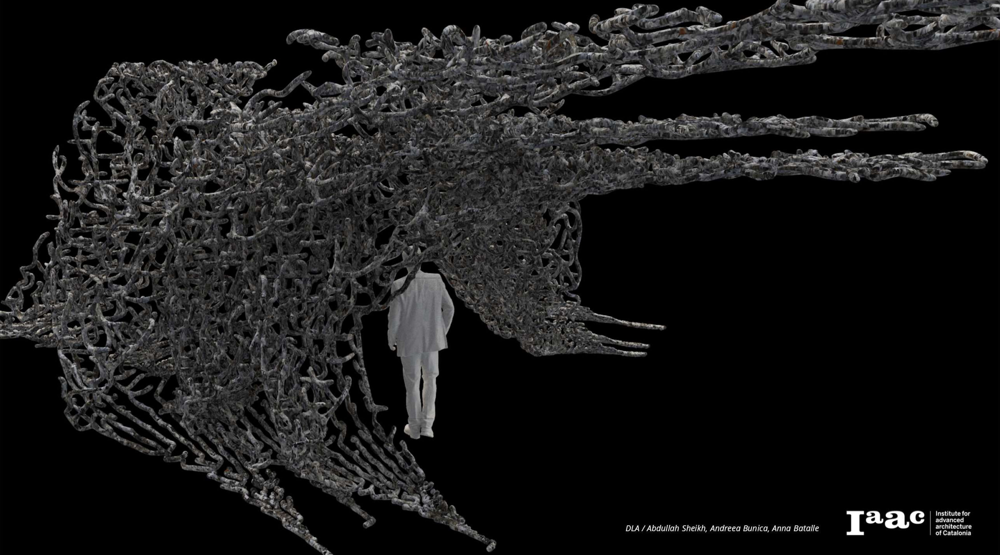
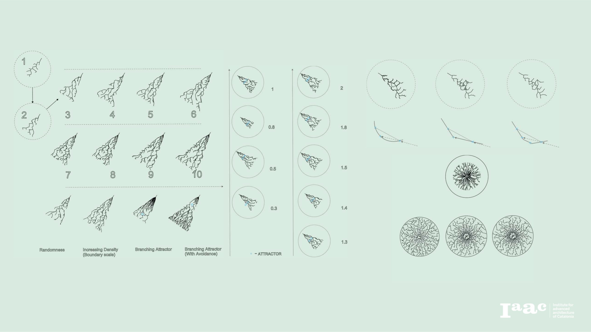
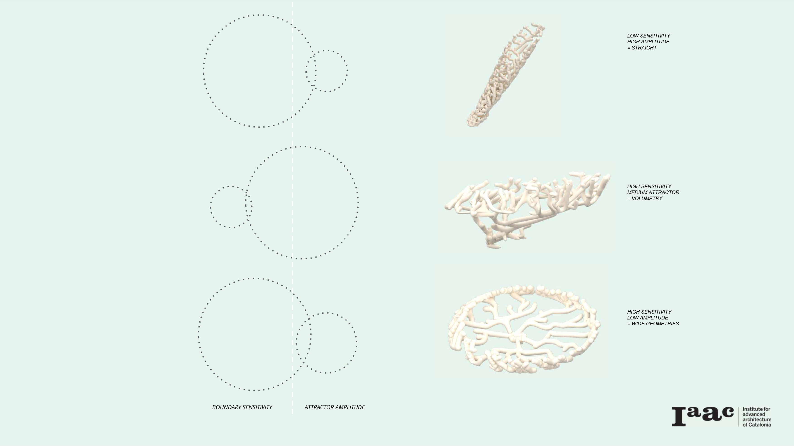
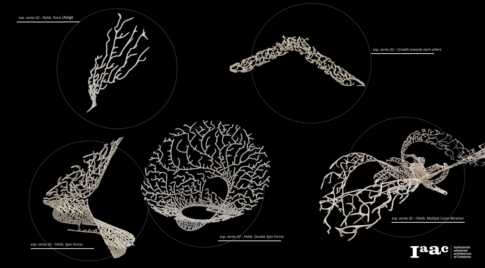
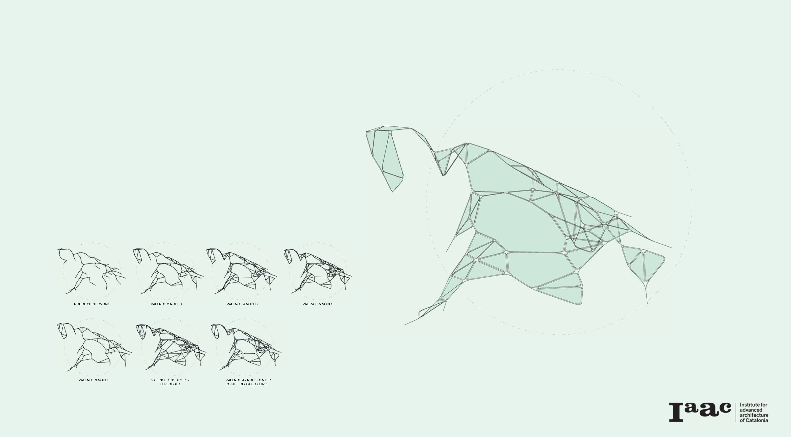
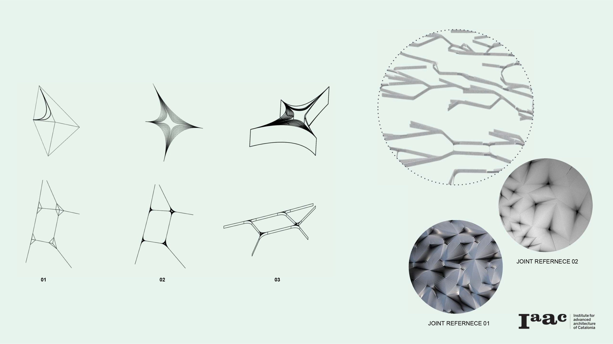
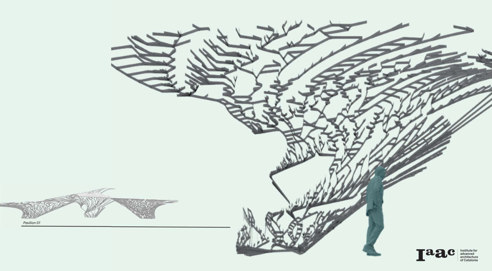

#### Diffusion Limited Aggregation

Diffusion Limited Aggregation is a project that explores the application of morphogenetic algorithms to generate complex systems. The aim of the project is to understand and control the algorithm in order to generate a structure that can be translated into a constructive system.

The DLA is a theoretical growth that describes the clustering of particles through a diffusion process.  
Diffusion: the particles that form the structure wander around randomly before attaching to the system.
Limited: The wonder particles are considered to be in low concentrations so they don’t collide with each other before they become part of the growing system.
Aggregation: when the particles achieve a certain distance (aggregation distance) from one of the growth components they get attached to it.The first experiments consist of various simulations of 2D growth to understand the parameters that affect the DLA: Number of Seed, DLA Aggregation Diameter, Attractor Point and Boundary

The next set of explorations aims to build a system in 3D. The strategy followed consists of placing the attractor point in a different plane than the rest of the parameters that define the growth and varying them to find out which role they perform in the definition of the DLA.

In order to gain control over the system field conditions are implemented in the definition:
Point Charge, generates an organized cantilever geometry until approximately 200 iterations. Once this amount of iterations are exceeded the attractor point gains relevance in the system and the particles stop to aggregating.
Spin Forces | Double Spin Forces. Spiral geometry
Growth towards each other: Generates a bridge structure
Multiple Curve Attractor: Controls the growth through the use of curves

For the constructability of the branching system, a post-DLA script has been applied. The purpose of the script is to get ride of the two balance nodes by augmenting the number of connections in the nodes.

Join definition. The first step to define the joint is the creation of node openings. The segment that connects with the attached particle is replaced with a two curvature connection. Using a tween curvature component, ramifications of these curvatures are created. Finally, an extrusion in the directions of the pavilion surface is performed. The next step would be to give thickness to the structure to get a constructive component.

Applying the script to a DLA pavilion developed with spin forces proof to not work accurately. Some modifications to the post DLA can be done to try to improve the shape obtained. However, the best approach would be to generate a DLA growth that allows for an easier rationalization of the structure.

